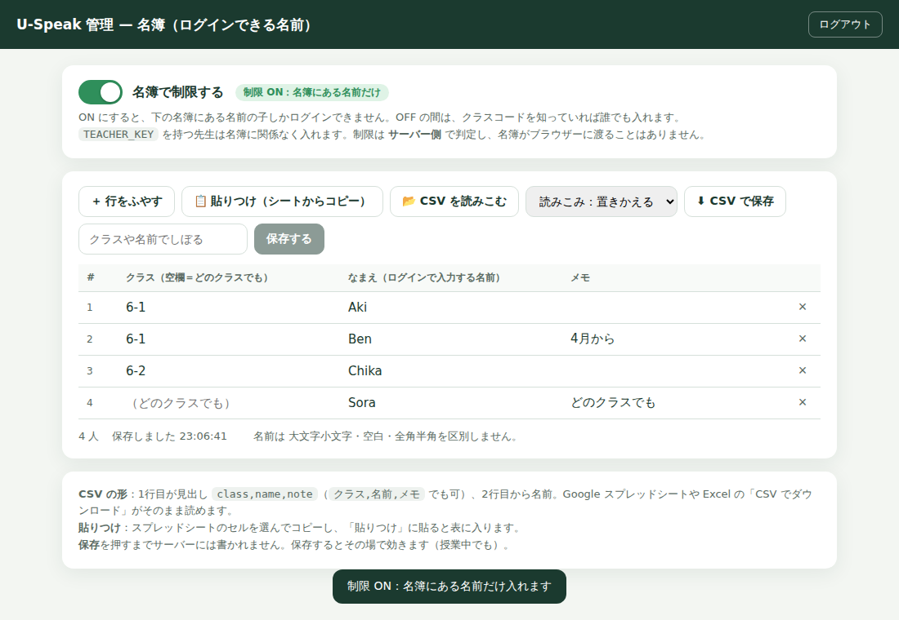

# 管理ページ（/admin）— 名簿にある名前の子しかログインできないようにする

Google スプレッドシートを使わずに、**U-Speak Web 自身の管理ページ**で名簿を持つやり方です。
管理パスワードで `https://uspeak-multiplayer.fly.dev/admin` に入り、表に名前を打つ・
スプレッドシートからコピーして貼る・CSV を読みこむ、のどれかで名簿を作り、
「名簿で制限する」を ON にします。

名簿はサーバーのボリューム（`data/roster.json`）に保存され、判定はすべてサーバー側です。
名簿がブラウザーに渡ることはありません。



## 1. 管理パスワードを決める（1回だけ）

```sh
fly secrets set --app uspeak-multiplayer ADMIN_KEY='<12文字以上の管理パスワード>'
```

```powershell
fly secrets set --app uspeak-multiplayer ADMIN_KEY='<12文字以上の管理パスワード>'
```

- `TEACHER_KEY`（先生が教室で使う鍵）とは**別のもの**にしてください。同じだと起動を拒否します。
- `fly secrets set` はそのままマシンを入れ替えます（`fly deploy` は不要）。1〜2分で戻ります。
- `ADMIN_KEY` が無いあいだ、`/admin` は**存在しません**（404）。

## 2. 管理ページで名簿を作る

`https://uspeak-multiplayer.fly.dev/admin` を開き、パスワードを入れます。

| やり方 | 手順 |
|---|---|
| 手で打つ | 「＋ 行をふやす」→ クラス・なまえ・メモ。Enter で次の行 |
| スプレッドシートから | シートで `クラス｜なまえ｜メモ` の列を選んでコピー →「📋 貼りつけ」に貼る →「表に入れる」 |
| CSV から | 「📂 CSV を読みこむ」。1行目が見出し `class,name,note`（`クラス,名前,メモ` でも可）。Google スプレッドシートや Excel の「CSV でダウンロード」がそのまま読めます（Shift_JIS も可） |

- **クラス** はロビーで入れるクラスコード。**空欄の行はどのクラスでも入れる**名前です。
- **なまえ** はロビーで子どもが打つ名前。大文字小文字・前後の空白・全角半角は区別しません。
- 読みこみは「置きかえる」「追加する」を選べます。
- **「保存する」を押すまでサーバーには書かれません。** 保存すると**その場で**効きます（授業中でも、5分待つ必要はありません）。
- 「⬇ CSV で保存」でいまの名簿を CSV にできます（Excel で開ける BOM つき UTF-8）。

## 3. 制限を ON にする

ページ上部の **「名簿で制限する」** を ON にします。

| 入ってきた人 | 結果 |
|---|---|
| 名簿にある名前の子 | 入れる |
| 名簿にない名前（前に遊んだことがあっても） | 入れない。画面に「この 名前は この クラスの めいぼに ありません」と出る |
| `TEACHER_KEY` を持つ先生 | 名簿を見ずに入れる |

OFF にすれば、クラスコードを知っていれば誰でも入れる元の状態に戻ります。
ON/OFF は `data/roster-settings.json` に保存され、再起動しても保たれます。

環境変数 `ACCESS_MODE` を設定していると、そちらが優先されてスイッチは動きません
（ページにその旨が出ます）。スイッチで切り替えたいときは `fly secrets unset ACCESS_MODE`。

## 4. 効いたかを確かめる

```sh
curl -s https://uspeak-multiplayer.fly.dev/healthz
```

- `"gate":{"mode":"roster","register":"file:/app/server/data/store.json","admin":true}` … 制限 ON・名簿はボリューム・管理ページあり
- `"mode":"open"` … 制限 OFF

## 安全のために

- パスワードの入力ミスが 10 分に 8 回続くと、その接続元はしばらく入れません。
- ログインは 12 時間で切れます（HttpOnly・SameSite=Strict の署名つき Cookie。サーバーには何も保存しません）。
- 書きこみはこのページ自身のスクリプトからだけ受けつけます（他サイトからのフォーム送信は通りません）。
- `/admin` は検索エンジンに載りません（noindex）。
- パスワードをチャットやメールに貼らないでください。忘れたら `fly secrets set ADMIN_KEY=...` で作り直せます。

## Google スプレッドシートと一緒に使うとき

`ROSTER_SHEET_ID` を設定している（`docs/ROSTER_SHEET.md`）と、名簿はそのシートから読みます。
管理ページは**見るだけ**になり、名前の追加・削除はシートで行います。
制限の ON/OFF スイッチはそのまま使えます。

## 仕組み（開発者向け）

- `server/src/admin/roster-admin.js` … `/admin`（ログイン・ページ）と `/admin/api/*`（名簿の読み書き・CSV の解析・スイッチ）。
- `server/src/admin/roster-admin.html` … 管理ページ本体（依存ライブラリなし）。
- `server/src/game/access.js` … スイッチ（`roster-settings.json`）と名簿の出し入れ。ゲートに `mode()` と `version` を渡す。
- `server/src/store/roster-text.js` … CSV / TSV / 貼りつけの解析（RFC 4180・Shift_JIS 判定）と CSV 出力。
- `server/src/store/FileStore.js` `saveRoster` … `data/roster.json` を丸ごと原子的に書く。`SheetsStore` は `roster` タブに書く。
- `server/src/game/gate.js` … 保存のたびに `version` が進み、キャッシュした名簿をその場で読み直す。
- テスト：`server/test/admin.test.mjs`（実ソケットで、保存した名前が入れ、消した名前が入れないところまで）。
